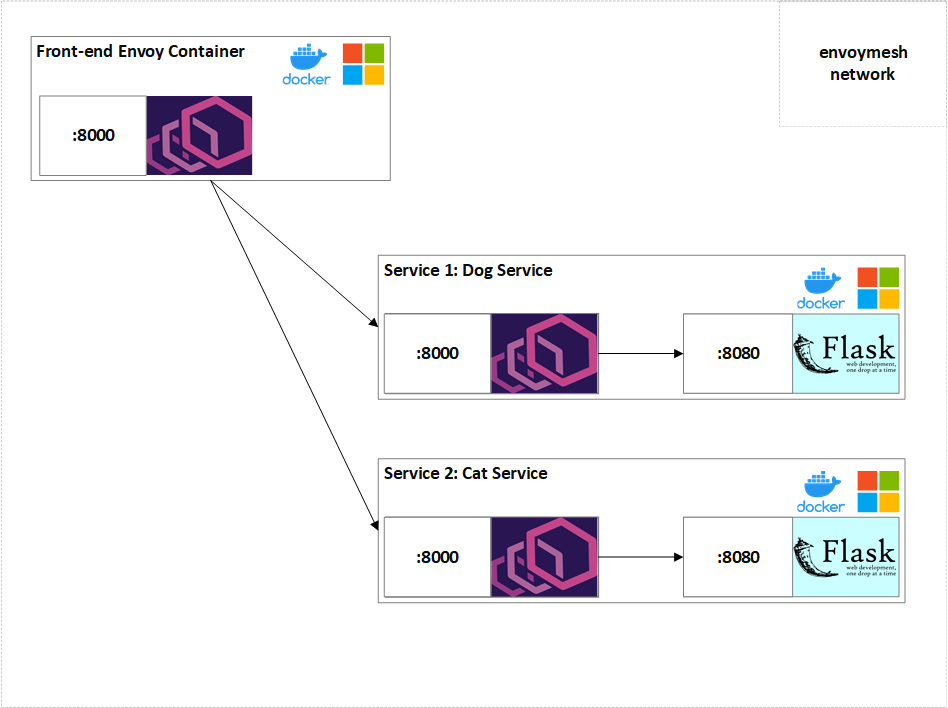

## Envoy on Windows Containers

Recently, Envoy released the alpha version of the proxy for Windows containers. To see how to build Envoy Proxy from source on Windows and submit feedback please refer to this [document](https://docs.google.com/document/d/1-sj_LSX93MXPbZpbV8TYc_WgpdHhd4LvrceVx2vDrMg/edit?usp=sharing).

In this code we use Envoy Proxy and Windows Server Core containers to split the traffic between two services. The architecture that we are trying to achieve is the following:



## How to run the code

### Requirements

- [ ] Docker for Windows
- [ ] Envoy proxy static executable built from source
- [ ] A Windows (Server) machine running on version greater than 2019

If you try to run this code on a VM machine make sure that you have nested virtualization enabled and working.

### Setup

1. Make sure that envoy-proxy is inside the local directory:

``` Powershell
PS D:\envoy-test> Test-Path .\envoy-static.exe
True
```

2. Check that Docker is installed and running:

``` Powershell
PS D:\envoy-test> docker version
Client: Docker Engine - Community
 Azure integration  0.1.15
 Version:           19.03.12
 API version:       1.40
 Go version:        go1.13.10
 Git commit:        48a66213fe
 Built:             Mon Jun 22 15:43:18 2020
 OS/Arch:           windows/amd64
 Experimental:      false

Server: Docker Engine - Community
 Engine:
  Version:          19.03.12
  API version:      1.40 (minimum version 1.24)
  Go version:       go1.13.10
  Git commit:       48a66213fe
  Built:            Mon Jun 22 15:57:30 2020
  OS/Arch:          windows/amd64
  Experimental:     false
```

3. Get the network up and running:

``` Powershell
PS D:\envoy-test>docker-compose build --pull
PS D:\envoy-test>docker-compose up -d
PS D:\envoy-test> docker-compose ps
          Name                        Command               State                            Ports
----------------------------------------------------------------------------------------------------------------------------
envoy-test_cat-service_1   cmd /S /C powershell ./ser ...   Up      8000/tcp, 8080/tcp
envoy-test_dog-service_1   cmd /S /C powershell ./ser ...   Up      8000/tcp, 8080/tcp
envoy-test_front-envoy_1   envoy-static.exe -c ./envo ...   Up      8000/tcp, 0.0.0.0:3000->8080/tcp, 0.0.0.0:8081->8081/tcp

```

4. Test the network

* Visit `localhost:8000` to see the pets website. If you refresh you should see the traffic going sometimes to service 1 and sometimes to service 2.
* Visit `localhost:8081` to see Envoy admin page and the collected stats.

### Usefull docker commands

1. Docker version:`docker version`
1. List all containers: `docker-compose ps`
1. Stop all running containers: `docker stop $(docker ps -a -q)`
1. Remove all running containers: `docker rm $(docker-compose ps -a -q)`
1. Interactive terminal `docker container exec -it <container name> powershell`
